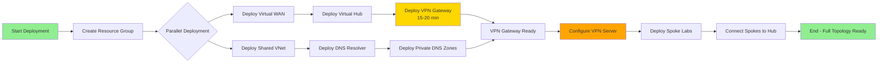

# Architecture Diagram: Core Azure vWAN Infrastructure

## Hub-Spoke Network Topology with Point-to-Site VPN

```mermaid
graph TB
    subgraph "Remote VPN Clients"
        CLIENT1[Laptop<br/>Azure VPN Client]
        CLIENT2[Desktop<br/>Azure VPN Client]
        CLIENT3[Mobile<br/>Azure VPN Client]
    end
    
    subgraph "Azure Subscription"
        subgraph "rg-ai-core (East US 2)"
            subgraph "Virtual WAN Hub (10.0.0.0/16)"
                VWAN[vwan-ai-hub<br/>Standard SKU]
                VHUB[hub-ai-eastus2<br/>Address: 10.0.0.0/16]
                VPNCONFIG[vpnconfig-ai-hub<br/>VPN Server Config<br/>Auth: Microsoft Entra ID<br/>Protocol: OpenVPN]
                VPNGW[vpngw-ai-hub<br/>Point-to-Site VPN<br/>Client Pool: 172.16.0.0/24<br/>1 Scale Unit (500 Mbps)]
                
                VWAN --> VHUB
                VHUB --> VPNGW
                VPNCONFIG --> VPNGW
            end
        end
        
        subgraph "rg-ai-storage (Spoke 1)"
            VNET1[vnet-storage<br/>10.1.0.0/16]
            VM1[Azure VMs<br/>Storage Services]
            VNET1 --> VM1
        end
        
        subgraph "rg-ai-ml (Spoke 2)"
            VNET2[vnet-ml<br/>10.2.0.0/16]
            VM2[ML Compute<br/>Training Resources]
            VNET2 --> VM2
        end
        
        subgraph "rg-ai-other (Spoke 3)"
            VNET3[vnet-other<br/>10.3.0.0/16]
            VM3[Lab Resources<br/>Experiments]
            VNET3 --> VM3
        end
    end
    
    %% Connections
    CLIENT1 -->|OpenVPN Tunnel<br/>Entra ID Auth| VPNGW
    CLIENT2 -->|OpenVPN Tunnel<br/>Entra ID Auth| VPNGW
    CLIENT3 -->|OpenVPN Tunnel<br/>Entra ID Auth| VPNGW
    VHUB -.->|VNet Connection| VNET1
    VHUB -.->|VNet Connection| VNET2
    VHUB -.->|VNet Connection| VNET3
    
    style VPNGW fill:#f25022,color:#fff
    style VPNCONFIG fill:#0078d4,color:#fff
    style VHUB fill:#7fba00,color:#000
    style VNET1 fill:#e3e3e3,color:#000
    style VNET2 fill:#e3e3e3,color:#000
    style VNET3 fill:#e3e3e3,color:#000
    style CLIENT1 fill:#0078d4,color:#fff
    style CLIENT2 fill:#0078d4,color:#fff
    style CLIENT3 fill:#0078d4,color:#fff
```

## Network Topology Details

### Address Space Allocation

| Resource | Address Space | Purpose | Notes |
|----------|---------------|---------|-------|
| Virtual Hub | 10.0.0.0/16 | Hub services, VPN Gateway | 65,536 addresses |
| VPN Client Pool | 172.16.0.0/24 | P2S VPN client addresses | 254 clients max |
| Spoke 1 (Storage) | 10.1.0.0/16 | Storage lab resources | Non-overlapping |
| Spoke 2 (ML) | 10.2.0.0/16 | Machine learning lab | Non-overlapping |
| Spoke 3 (Other) | 10.3.0.0/16 | Future labs | Non-overlapping |
| Future Spokes | 10.4.0.0/16+ | Additional labs | Reserve up to 10.255.0.0/16 |

### Routing

**Virtual Hub Default Route Table**:
- Automatically propagates spoke routes to connected VNets
- Hub-to-spoke traffic enabled by default
- Spoke-to-spoke traffic controlled by `allowBranchToBranchTraffic` (enabled)
- VPN clients can access all connected spoke VNets

**P2S VPN Client Routing**:
- Clients receive IP addresses from 172.16.0.0/24 pool
- Routes to all spoke VNets (10.x.0.0/16) automatically pushed to clients
- Split tunneling: only Azure traffic routed through VPN (internet via local)

### Security Boundaries

1. **Network Isolation**: Each spoke VNet is isolated by default
2. **Hub-Mediated Communication**: All inter-spoke traffic goes through hub
3. **Zero-Trust Access**: Role-based access control with Microsoft Entra integration
4. **Private DNS**: Private endpoint resolution via DNS Private Resolver

## Deployment Flow



**Timeline**:
1. Resource Group: ~5 seconds
2. Virtual WAN: ~2 minutes
3. Shared Services VNet: ~2 minutes
4. Virtual Hub: ~5 minutes (depends on Virtual WAN)
5. DNS Resolver: ~3-5 minutes
6. **VPN Gateway: ~15-20 minutes** (longest component)
7. Total: **~25-30 minutes**

## Data Flow Scenarios

### Scenario 1: User Accessing Azure VM via VPN

```
[User Device] 
    → [VPN Client Application]
    → [Site-to-Site VPN Tunnel with BGP]
    → [Azure VPN Gateway (vpngw-ai-hub)]
    → [Virtual Hub (hub-ai-eastus2)]
    → [Spoke VNet Connection]
    → [Target VM in Spoke (10.1.0.4)]
```

### Scenario 2: Spoke-to-Spoke Communication

```
[VM in Spoke 1 (10.1.0.4)]
    → [VNet Connection to Hub]
    → [Virtual Hub Routing]
    → [VNet Connection to Spoke 2]
    → [VM in Spoke 2 (10.2.0.5)]
```

### Scenario 3: Private Endpoint Resolution

```
[VPN Client (172.16.x.x)]
    → [DNS Query for privatelink.blob.core.windows.net]
    → [DNS Resolver (10.1.0.68)]
    → [Private DNS Zone lookup]
    → [Returns Private IP (10.1.0.x)]
    → [Client connects to Storage via private endpoint]
```

## High Availability Considerations

### Current Configuration (Single Region)
- **Virtual WAN Hub**: Single hub in East US 2
- **VPN Gateway**: Active-passive (1 scale unit)
- **DNS Resolver**: Single inbound endpoint

### Future Enhancements
1. **Multi-hub**: Add second hub in Central US for disaster recovery
2. **VPN Gateway Scaling**: Increase to 2+ scale units for active-active
3. **ExpressRoute**: Add ExpressRoute gateway for hybrid connectivity
4. **Azure Firewall**: Insert firewall in hub for advanced security

## Cost Estimation (Monthly)

| Resource | SKU/Config | Estimated Cost |
|----------|------------|----------------|
| Virtual WAN Hub | Standard | ~$0.25/hour × 730h = ~$182 |
| VPN Gateway | 1 scale unit | ~$0.361/hour × 730h = ~$264 |
| DNS Resolver | Inbound endpoint | ~$0.0018/hour × 730h = ~$1.30 |
| **Total** | | **~$447/month** |

**Notes**:
- Spoke VNets incur peering charges (~$0.01/GB ingress)
- VPN Gateway licensing included in Azure subscription
- Data transfer charges apply for outbound traffic

---

**Version**: 1.0.0  
**Last Updated**: 2025-12-31  
**Diagram Format**: Mermaid (rendered in GitHub, VS Code, documentation platforms)
