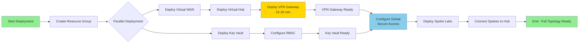

# Architecture Diagram: Core Azure vWAN Infrastructure

## Hub-Spoke Network Topology with Global Secure Access

```mermaid
graph TB
    subgraph "Microsoft Entra Global Secure Access (SSE)"
        GSA[Global Secure Access]
        PA[Private Access]
        IA[Internet Access]
        M365[M365 Access]
        
        GSA --> PA
        GSA --> IA
        GSA --> M365
    end
    
    subgraph "Azure Subscription"
        subgraph "rg-ai-core (East US 2)"
            subgraph "Virtual WAN Hub (10.0.0.0/16)"
                VWAN[vwan-ai-hub<br/>Standard SKU]
                VHUB[hub-ai-eastus2<br/>Address: 10.0.0.0/16]
                VPNGW[vpngw-ai-hub<br/>Site-to-Site VPN<br/>BGP Enabled (ASN: 65515)<br/>1 Scale Unit (500 Mbps)]
                
                VWAN --> VHUB
                VHUB --> VPNGW
            end
            
            KV[kv-ai-core-*<br/>Key Vault<br/>RBAC Authorization<br/>Soft-Delete: 90 days]
        end
        
        subgraph "rg-ai-storage (Spoke 1)"
            VNET1[vnet-storage<br/>10.1.0.0/16]
            VM1[Azure VMs<br/>Storage Services]
            VNET1 --> VM1
        end
        
        subgraph "rg-ai-ml (Spoke 2)"
            VNET2[vnet-ml<br/>10.2.0.0/16]
            VM2[ML Compute<br/>Training Resources]
            VNET2 --> VM2
        end
        
        subgraph "rg-ai-other (Spoke 3)"
            VNET3[vnet-other<br/>10.3.0.0/16]
            VM3[Lab Resources<br/>Experiments]
            VNET3 --> VM3
        end
    end
    
    subgraph "User Devices"
        CLIENT[Entra Client<br/>with Global Secure<br/>Access Agent]
    end
    
    %% Connections
    GSA -->|Site-to-Site VPN<br/>with BGP| VPNGW
    VHUB -.->|VNet Connection| VNET1
    VHUB -.->|VNet Connection| VNET2
    VHUB -.->|VNet Connection| VNET3
    KV -.->|Secret References| VNET1
    KV -.->|Secret References| VNET2
    KV -.->|Secret References| VNET3
    CLIENT -->|Zero Trust Access| GSA
    
    style GSA fill:#0078d4,color:#fff
    style VPNGW fill:#f25022,color:#fff
    style VHUB fill:#7fba00,color:#000
    style KV fill:#ffb900,color:#000
    style VNET1 fill:#e3e3e3,color:#000
    style VNET2 fill:#e3e3e3,color:#000
    style VNET3 fill:#e3e3e3,color:#000
```

## Network Topology Details

### Address Space Allocation

| Resource | Address Space | Purpose | Notes |
|----------|---------------|---------|-------|
| Virtual Hub | 10.0.0.0/16 | Hub services, VPN Gateway | 65,536 addresses |
| Spoke 1 (Storage) | 10.1.0.0/16 | Storage lab resources | Non-overlapping |
| Spoke 2 (ML) | 10.2.0.0/16 | Machine learning lab | Non-overlapping |
| Spoke 3 (Other) | 10.3.0.0/16 | Future labs | Non-overlapping |
| Future Spokes | 10.4.0.0/16+ | Additional labs | Reserve up to 10.255.0.0/16 |

### Routing

**Virtual Hub Default Route Table**:
- Automatically propagates spoke routes via BGP
- Hub-to-spoke traffic enabled by default
- Spoke-to-spoke traffic controlled by `allowBranchToBranchTraffic` (enabled)

**BGP Route Propagation**:
- VPN Gateway (ASN: 65515) advertises hub and spoke routes to Global Secure Access
- Global Secure Access advertises remote network routes to Azure hub
- Dynamic routing enables automatic failover and load balancing

### Security Boundaries

1. **Network Isolation**: Each spoke VNet is isolated by default
2. **Hub-Mediated Communication**: All inter-spoke traffic goes through hub
3. **Global Secure Access Integration**: Zero-trust access enforced by Microsoft Entra
4. **Key Vault RBAC**: Centralized secrets with role-based access control

## Deployment Flow



**Timeline**:
1. Resource Group: ~5 seconds
2. Virtual WAN: ~2 minutes (parallel with Key Vault)
3. Key Vault: ~1 minute (parallel with Virtual WAN)
4. Virtual Hub: ~5 minutes (depends on Virtual WAN)
5. **VPN Gateway: ~15-20 minutes** (longest component)
6. Total: **~25-30 minutes**

## Data Flow Scenarios

### Scenario 1: User Accessing Azure VM via Private Access

```
[User Device] 
    → [Entra Global Secure Access Client]
    → [Global Secure Access Cloud (SSE)]
    → [Site-to-Site VPN Tunnel with BGP]
    → [Azure VPN Gateway (vpngw-ai-hub)]
    → [Virtual Hub (hub-ai-eastus2)]
    → [Spoke VNet Connection]
    → [Target VM in Spoke (10.1.0.4)]
```

### Scenario 2: Spoke-to-Spoke Communication

```
[VM in Spoke 1 (10.1.0.4)]
    → [VNet Connection to Hub]
    → [Virtual Hub Routing]
    → [VNet Connection to Spoke 2]
    → [VM in Spoke 2 (10.2.0.5)]
```

### Scenario 3: Secret Retrieval from Key Vault

```
[Bicep Deployment]
    → [Parameter File with Key Vault Reference]
    → [Azure Resource Manager]
    → [Key Vault (kv-ai-core-*)]
    → [RBAC Authorization Check]
    → [Secret Retrieved (never logged)]
    → [Passed to Resource]
```

## High Availability Considerations

### Current Configuration (Single Region)
- **Virtual WAN Hub**: Single hub in East US 2
- **VPN Gateway**: Active-passive (1 scale unit)
- **Key Vault**: Geo-replicated by Azure (paired region: Central US)

### Future Enhancements
1. **Multi-hub**: Add second hub in Central US for disaster recovery
2. **VPN Gateway Scaling**: Increase to 2+ scale units for active-active
3. **ExpressRoute**: Add ExpressRoute gateway for hybrid connectivity
4. **Azure Firewall**: Insert firewall in hub for advanced security

## Cost Estimation (Monthly)

| Resource | SKU/Config | Estimated Cost |
|----------|------------|----------------|
| Virtual WAN Hub | Standard | ~$0.25/hour × 730h = ~$182 |
| VPN Gateway | 1 scale unit | ~$0.361/hour × 730h = ~$264 |
| Key Vault | Standard, <10k ops | ~$0.03/secret + ops = ~$10 |
| **Total** | | **~$456/month** |

**Notes**:
- Spoke VNets incur peering charges (~$0.01/GB ingress)
- Global Secure Access licensing separate (per-user Microsoft Entra)
- Data transfer charges apply for outbound traffic

---

**Version**: 1.0.0  
**Last Updated**: 2025-12-31  
**Diagram Format**: Mermaid (rendered in GitHub, VS Code, documentation platforms)
