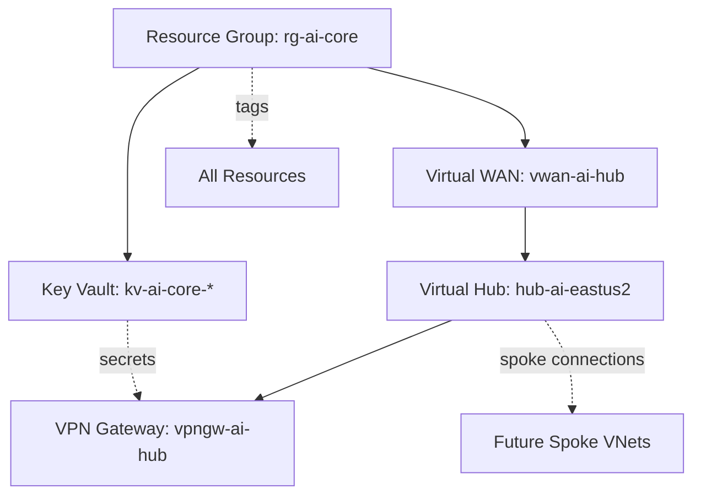

# Data Model: Core Azure vWAN Infrastructure

**Date**: 2025-12-31  
**Feature**: Core Azure vWAN Infrastructure  
**Purpose**: Define resource relationships, dependencies, and data flow for hub infrastructure

## Resource Entities

### 1. Resource Group: rg-ai-core

**Type**: Microsoft.Resources/resourceGroups  
**Purpose**: Logical container for all core infrastructure resources  
**Lifecycle**: Created first, deleted last  

**Attributes**:
- `name`: "rg-ai-core" (fixed per constitution)
- `location`: "eastus2" (deployment region)
- `tags`: Map of key-value pairs
  - `environment`: "dev" | "test" | "prod"
  - `purpose`: "Core hub infrastructure for AI labs"
  - `owner`: String (deployment principal or specified owner)
  - `deployedBy`: "manual" | "automation"
  - `deployedDate`: ISO 8601 timestamp

**Relationships**:
- **Contains**: Virtual WAN, VPN Gateway, Key Vault
- **Scopes**: RBAC permissions for all child resources

---

### 2. Virtual WAN: vwan-ai-hub

**Type**: Microsoft.Network/virtualWans  
**Purpose**: Managed hub for hub-spoke network topology  
**Lifecycle**: Created after resource group, before hub  

**Attributes**:
- `name`: "vwan-ai-hub"
- `location`: "eastus2"
- `sku`: "Standard" (required for VPN and spoke connections)
- `type`: "Standard"
- `allowBranchToBranchTraffic`: true (enables spoke-to-spoke communication)
- `disableVpnEncryption`: false (encryption required)

**Relationships**:
- **Parent**: Resource Group (rg-ai-core)
- **Contains**: Virtual Hub (below)

---

### 3. Virtual Hub: hub-ai-eastus2

**Type**: Microsoft.Network/virtualHubs  
**Purpose**: Regional hub instance within Virtual WAN  
**Lifecycle**: Created after Virtual WAN, hosts VPN Gateway  

**Attributes**:
- `name`: "hub-ai-eastus2"
- `location`: "eastus2"
- `addressPrefix`: "10.0.0.0/16" (65,536 addresses for hub services)
- `sku`: "Standard"
- `virtualWan`: Reference to vwan-ai-hub
- `routingState`: "Provisioned" (read-only, set by Azure)

**Relationships**:
- **Parent**: Virtual WAN (vwan-ai-hub)
- **Contains**: VPN Gateway
- **Connects to**: Spoke virtual networks (future labs)
- **Routing**: Default route table for spoke connections

---

### 4. VPN Gateway: vpngw-ai-hub

**Type**: Microsoft.Network/vpnGateways  
**Purpose**: Site-to-site VPN endpoint for Microsoft Entra Global Secure Access integration  
**Lifecycle**: Created after Virtual Hub  

**Attributes**:
- `name`: "vpngw-ai-hub"
- `location`: "eastus2"
- `virtualHub`: Reference to hub-ai-eastus2
- `bgpSettings`: BGP configuration (required for Global Secure Access)
  - `asn`: 65515 (default Azure ASN)
  - `bgpPeeringAddress`: Auto-assigned by Azure
  - `peerWeight`: 0
- `vpnGatewayScaleUnit`: 1 (500 Mbps aggregate, scalable to 20 units)
- `enableBgpRouteTranslationForNat`: false
- `isRoutingPreferenceInternet`: false

**Relationships**:
- **Parent**: Virtual Hub (hub-ai-eastus2)
- **Connects to**: Microsoft Entra Global Secure Access via site-to-site VPN tunnels
- **Secrets**: VPN shared keys stored in Key Vault

**Global Secure Access Integration**:
- Configured as site-to-site VPN (not point-to-site)
- BGP enabled for dynamic route propagation
- Supports Security Service Edge (SSE) traffic policies
- Integrates with Microsoft Entra conditional access
- Enables Private Access, Internet Access, and M365 Access capabilities

**State Transitions**:
1. Initial: Not provisioned
2. Deploying: Azure creates gateway resources (10-20 minutes)
3. Provisioned: Ready for VPN connections
4. Connected: Global Secure Access tunnels established
5. Updating: Scale units or configuration changing
6. Deleting: Gateway being removed

---

### 5. Key Vault: kv-ai-core-{random}

**Type**: Microsoft.KeyVault/vaults  
**Purpose**: Centralized secrets management for all labs  
**Lifecycle**: Created after resource group, independent of networking  

**Attributes**:
- `name`: "kv-ai-core-{random}" (globally unique, 3-24 chars)
- `location`: "eastus2"
- `sku`: "standard" (or "premium" for HSM-backed keys)
- `enableRbacAuthorization`: true (use RBAC, not access policies)
- `enableSoftDelete`: true (90-day retention, cannot be disabled)
- `enablePurgeProtection`: true (recommended for production)
- `softDeleteRetentionInDays`: 90
- `networkAcls`: Network access rules
  - `defaultAction`: "Allow" (initially open, can restrict later)
  - `bypass`: "AzureServices"

**Relationships**:
- **Parent**: Resource Group (rg-ai-core)
- **Referenced by**: All lab Bicep deployments for secrets
- **Contains**: Secrets (VPN keys, connection strings, passwords)
- **Access controlled by**: Azure RBAC roles

**Secret Schema Examples**:
```json
{
  "vpn-shared-key": "Base64-encoded shared key for VPN",
  "admin-password": "Administrator password for VMs",
  "connection-string-*": "Database connection strings for labs"
}
```

---

## Resource Dependencies (Deployment Order)



**Deployment Sequence**:
1. **Resource Group** (rg-ai-core) - ~5 seconds
2. **Parallel**:
   - Virtual WAN (vwan-ai-hub) - ~2 minutes
   - Key Vault (kv-ai-core-*) - ~1 minute
3. **Virtual Hub** (hub-ai-eastus2) - ~5 minutes (depends on vWAN)
4. **VPN Gateway** (vpngw-ai-hub) - ~15-20 minutes (depends on hub)

**Total Deployment Time**: ~25-30 minutes (well within 30-minute success criteria)

---

## Data Flow

### Deployment Time
1. **Parameter Input** → Bicep main.bicep
2. **Bicep Compilation** → ARM JSON template
3. **ARM Deployment** → Azure Resource Manager
4. **Resource Creation** → Azure services
5. **Resource IDs** → Deployment outputs

### Runtime (VPN Connectivity)
1. **Remote Client/Site** → VPN Gateway (vpngw-ai-hub)
2. **VPN Gateway** → Virtual Hub (hub-ai-eastus2)
3. **Virtual Hub** → Spoke VNets (future labs)
4. **Spoke VNets** → Lab resources

### Secret Management
1. **Administrator** → Store secret in Key Vault
2. **Bicep Deployment** → Reference Key Vault secret via parameter file
3. **Azure ARM** → Retrieve secret during deployment
4. **Resource** → Receive secret value (never logged or exposed)

---

## Validation Rules

### Resource Group
- Name must be exactly "rg-ai-core" (constitutional requirement)
- Location must be valid Azure region
- Tags must include: environment, purpose, owner

### Virtual WAN
- SKU must be "Standard" (Basic doesn't support spoke connections)
- Location must match resource group
- Branch-to-branch traffic enabled for future spoke-to-spoke

### Virtual Hub
- Address prefix must not overlap with existing VNets
- Recommended: 10.0.0.0/16 (can be adjusted if conflicts arise)
- Must be within Virtual WAN

### VPN Gateway
- Scale units: 1-20 (start with 1, scale up if needed)
- Must be attached to Virtual Hub
- BGP ASN must be unique if connecting multiple sites

### Key Vault
- Name must be globally unique (add random suffix)
- Name: 3-24 characters, alphanumeric and hyphens
- RBAC authorization must be enabled (constitutional requirement)
- Soft-delete must be enabled (Azure enforces this)

---

## State Management

All resources are **stateless from Bicep perspective** - state managed by Azure Resource Manager:
- Bicep is declarative: describes desired state
- ARM compares desired state to current state
- ARM calculates minimal changes needed
- What-if mode shows planned changes before applying

**Idempotency**: Running deployment multiple times with same parameters results in same state (no duplicates, no errors)

**State Queries**: Use Azure CLI or Portal to check current state:
```bash
az group show --name rg-ai-core
az network vwan show --resource-group rg-ai-core --name vwan-ai-hub
az keyvault show --name kv-ai-core-{random}
```

---

## Future Spoke Lab Integration

When deploying spoke labs (e.g., rg-ai-storage, rg-ai-ml):
1. Create spoke VNet in spoke resource group
2. Create VNet connection to hub: `az network vhub connection create`
3. Hub automatically routes traffic to other spokes
4. Spoke references Key Vault (kv-ai-core-*) for secrets

**Spoke VNet Constraints**:
- Address space must not overlap with hub (10.0.0.0/16) or other spokes
- Recommended spoke ranges: 10.1.0.0/16, 10.2.0.0/16, etc.
- Each spoke is independently deployable/deletable
