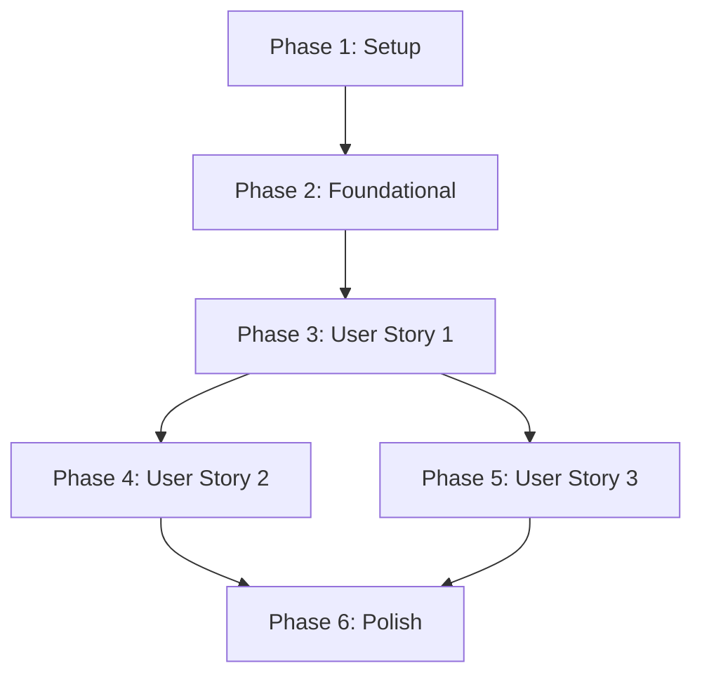

# Tasks: Core Azure vWAN Infrastructure with Global Secure Access

**Input**: Design documents from `/specs/001-vwan-core/`
**Prerequisites**: plan.md, spec.md, research.md, data-model.md, contracts/, quickstart.md

**Tests**: No test tasks included - validation performed via Azure CLI what-if and post-deployment validation scripts.

**Organization**: Tasks are grouped by user story to enable independent implementation and testing of each story.

## Format: `[ID] [P?] [Story] Description`

- **[P]**: Can run in parallel (different files, no dependencies)
- **[Story]**: Which user story this task belongs to (US1, US2, US3)
- Include exact file paths in descriptions

## Path Conventions

Infrastructure as Code structure:
- `bicep/` - Bicep templates and modules
- `scripts/` - Deployment and validation scripts
- `docs/core-infrastructure/` - Documentation

---

## Phase 1: Setup (Project Infrastructure)

**Purpose**: Initialize project structure, configuration, and prerequisites

- [ ] T001 Create bicep/ directory structure with modules/ subdirectory
- [ ] T002 Create scripts/ directory for deployment automation
- [ ] T003 Create docs/core-infrastructure/ directory for documentation
- [ ] T004 [P] Create .gitignore rules to exclude *.local.parameters.json and Azure credentials
- [ ] T005 [P] Create README.md in repository root explaining project purpose and structure

---

## Phase 2: Foundational (Blocking Prerequisites)

**Purpose**: Reusable Bicep modules that ALL user stories depend on

**⚠️ CRITICAL**: No user story work can begin until this phase is complete

- [ ] T006 Create resource-group.bicep module in bicep/modules/ with parameterized name, location, and tags
- [ ] T007 Create parameter schema bicep/main.parameters.schema.json with validation rules per contracts/

**Checkpoint**: Foundation ready - user story implementation can now begin in parallel

---

## Phase 3: User Story 1 - Deploy Foundation Infrastructure (Priority: P1) 🎯 MVP

**Goal**: Deploy complete core infrastructure (resource group, vWAN, site-to-site VPN Gateway for Global Secure Access, Key Vault) ready for spoke lab connections and SSE integration

**Independent Test**: Run deployment to Azure, verify all resources in "Succeeded" state, confirm vWAN hub operational, validate site-to-site VPN Gateway ready for Global Secure Access

### Implementation for User Story 1

**Bicep Modules** (can be built in parallel):

- [X] T008 [P] [US1] Create vwan-hub.bicep module in bicep/modules/ with Virtual WAN and Virtual Hub resources
- [X] T009 [P] [US1] Create vpn-gateway.bicep module in bicep/modules/ with site-to-site VPN Gateway resource (BGP enabled for Global Secure Access)
- [X] T010 [P] [US1] Create key-vault.bicep module in bicep/modules/ with RBAC authorization, soft-delete, and purge protection parameters

**Main Template**:

- [X] T011 [US1] Create main.bicep in bicep/ orchestrating resource group, vWAN, site-to-site VPN Gateway (with BGP for Global Secure Access), and Key Vault modules
- [X] T012 [US1] Define outputs in main.bicep (resourceGroupId, vhubId, vhubName, vpnGatewayId, vpnGatewayBgpSettings, keyVaultId, keyVaultUri, keyVaultName)
- [X] T013 [US1] Add inline comments in all Bicep files explaining design decisions, Global Secure Access integration requirements, and configuration choices

**Parameters**:

- [X] T014 [US1] Create main.parameters.json in bicep/ with default parameters (no secrets): location=eastus2, environment=dev
- [X] T015 [US1] Create main.parameters.example.json showing all configurable parameters with descriptions

**Deployment Scripts**:

- [X] T016 [US1] Create deploy-core.sh in scripts/ with what-if validation, user confirmation, and deployment logic
- [X] T017 [US1] Add parameter validation in deploy-core.sh using JSON schema
- [X] T018 [US1] Add error handling and rollback documentation in deploy-core.sh
- [X] T019 [US1] Make deploy-core.sh executable and test parameter parsing

**Documentation**:

- [X] T020 [US1] Create docs/core-infrastructure/README.md following constitution template (Overview, Prerequisites, Architecture with Global Secure Access, Deployment, Configuration, Testing, Cleanup, Troubleshooting)
- [X] T021 [US1] Create docs/core-infrastructure/architecture-diagram.png or .md showing hub-spoke topology with Global Secure Access integration
- [X] T021a [US1] Document Global Secure Access integration steps in docs/core-infrastructure/global-secure-access.md

**Checkpoint**: User Story 1 complete - core infrastructure can be deployed to Azure and is ready for Global Secure Access configuration

---

## Phase 4: User Story 2 - Validate Deployment (Priority: P2)

**Goal**: Automated validation confirming resources are properly configured and ready for spoke connections

**Independent Test**: Run validation script after US1 deployment, verify all checks pass with zero configuration drift

### Implementation for User Story 2

**Validation Scripts**:

- [X] T022 [US2] Create validate-core.sh in scripts/ to check resource existence using Azure CLI
- [X] T023 [US2] Add resource provisioning state checks to validate-core.sh (all resources "Succeeded")
- [X] T024 [US2] Add Virtual Hub routing state check to validate-core.sh (routingState: Provisioned)
- [X] T024a [US2] Add VPN Gateway BGP validation to validate-core.sh (verify BGP enabled for Global Secure Access)
- [X] T025 [US2] Add naming convention validation to validate-core.sh (verify rg-ai-core pattern)
- [X] T026 [US2] Add tagging validation to validate-core.sh (environment, purpose, owner tags present)
- [X] T027 [US2] Add Key Vault RBAC configuration check to validate-core.sh
- [X] T028 [US2] Add what-if drift detection to validate-core.sh (should show "no changes" after deployment)
- [X] T029 [US2] Add test secret creation/retrieval/deletion to validate-core.sh for Key Vault access verification
- [X] T030 [US2] Make validate-core.sh executable and add usage documentation

**Documentation Updates**:

- [X] T031 [US2] Add validation section to docs/core-infrastructure/README.md with validation script usage
- [X] T032 [US2] Create docs/core-infrastructure/troubleshooting.md with common issues and solutions

**Checkpoint**: User Story 2 complete - validation automation ensures deployment quality

---

## Phase 5: User Story 3 - Secure Parameter Management (Priority: P3)

**Goal**: Demonstrate parameter files using Key Vault references with no secrets in source control

**Independent Test**: Review parameter files in repository - verify no hardcoded secrets, verify .gitignore excludes local files

### Implementation for User Story 3

**Parameter Files with Key Vault References**:

- [X] T033 [US3] Create main.keyvault-ref.parameters.json example in bicep/ showing Key Vault reference syntax for sensitive values
- [X] T034 [US3] Document in main.keyvault-ref.parameters.json how to reference secrets from deployed Key Vault
- [X] T035 [US3] Update .gitignore to exclude *.local.parameters.json and *.secrets.*

**Documentation Updates**:

- [X] T036 [US3] Add "Secure Parameter Management" section to docs/core-infrastructure/README.md
- [X] T037 [US3] Document workflow: store secret in Key Vault → reference in parameter file → deploy
- [X] T038 [US3] Add examples of storing secrets using Azure CLI in documentation

**Security Verification**:

- [X] T039 [US3] Create script to scan repository for common secret patterns (keys, passwords, connection strings)
- [X] T040 [US3] Document security best practices in docs/core-infrastructure/README.md

**Checkpoint**: User Story 3 complete - secure parameter management patterns documented and demonstrated

---

## Phase 6: Polish & Cross-Cutting Concerns

**Purpose**: Final refinements, deployment testing, and project-wide improvements

**Cleanup Scripts**:

- [X] T041 Create cleanup-core.sh in scripts/ to safely delete all core infrastructure
- [X] T042 Add spoke connection cleanup to cleanup-core.sh (delete connections before resource group)
- [X] T043 Add Key Vault purge option to cleanup-core.sh with warning
- [X] T044 Make cleanup-core.sh executable with confirmation prompts

**Integration Documentation**:

- [X] T045 Update repository root README.md with quickstart links and project overview
- [X] T046 Create CONTRIBUTING.md with guidelines for adding spoke labs
- [X] T047 Document spoke lab connection pattern in docs/core-infrastructure/README.md

**Final Validation**:

- [X] T048 Test complete deployment workflow: deploy → validate → cleanup → redeploy (idempotency)
- [X] T049 Verify deployment completes in under 30 minutes (Success Criteria SC-001)
- [X] T050 Run all validation checks and confirm zero drift (Success Criteria SC-002)
- [X] T051 Verify all files follow constitution requirements (Bicep only, no secrets, RBAC, documentation)

---

## Dependencies & Parallel Execution

### Dependency Graph (User Story Completion Order)

**Critical Path**: Setup → Foundational → US1 → US2 → Polish

**Independent After US1**: US2 and US3 can be worked on in parallel after US1 completes

### Parallelization Opportunities

**Phase 1 (Setup)**: 
- T004, T005 can run in parallel (different files)

**Phase 3 (User Story 1)**:
- T008, T009, T010 can run in parallel (independent Bicep modules)
- After T011 completes: T014, T015, T020, T021 can run in parallel

**Phase 4 (User Story 2)** and **Phase 5 (User Story 3)** can be worked on in parallel after US1 is deployed

**Total Parallelizable Tasks**: 15 tasks marked with [P]

---

## Implementation Strategy

### MVP Scope (Minimum Viable Product)

**MVP = User Story 1 (P1) Only**

Delivers: Complete core infrastructure deployed to Azure with vWAN hub, VPN Gateway, and Key Vault ready for spoke connections.

### Incremental Delivery

1. **Sprint 1**: Phase 1 + Phase 2 + User Story 1 → Deployable core infrastructure
2. **Sprint 2**: User Story 2 → Automated validation
3. **Sprint 3**: User Story 3 → Secure parameter management
4. **Sprint 4**: Phase 6 → Polish and documentation

Each sprint delivers independently testable value.

---

## Task Summary

- **Total Tasks**: 53 (updated for Global Secure Access)
- **Setup Tasks**: 5 (Phase 1)
- **Foundational Tasks**: 2 (Phase 2)
- **User Story 1 Tasks**: 16 (P1 - MVP with Global Secure Access)
- **User Story 2 Tasks**: 12 (P2 - Validation with BGP checks)
- **User Story 3 Tasks**: 8 (P3 - Security)
- **Polish Tasks**: 11 (Phase 6)
- **Parallelizable Tasks**: 15 (marked with [P])

**Estimated Effort**: 
- MVP (US1): ~3-5 days (core Bicep + site-to-site VPN + Global Secure Access docs)
- Full Implementation: ~6-8 days (all stories + validation + polish)

---

## Validation Checklist

Format validation:
- ✅ All tasks follow `- [ ] [ID] [Labels] Description with file path` format
- ✅ All User Story phase tasks have [Story] label (US1, US2, US3)
- ✅ Setup and Foundational phases have NO story labels
- ✅ Tasks organized by user story with clear checkpoints
- ✅ Each user story has independent test criteria
- ✅ Dependencies section shows story completion order
- ✅ Parallel execution opportunities identified

Content validation:
- ✅ All 14 functional requirements from spec.md addressed in tasks
- ✅ All 4 key entities from data-model.md have corresponding Bicep modules
- ✅ Deployment contract from contracts/ implemented in scripts
- ✅ Quickstart guide steps mapped to implementation tasks
- ✅ Constitution requirements (Bicep, no secrets, RBAC, documentation) enforced
