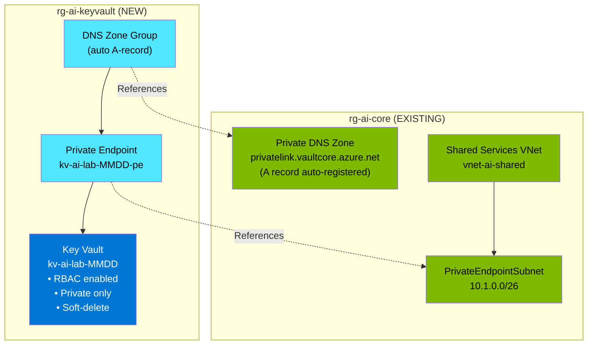

# Data Model: Private Azure Key Vault Infrastructure

**Feature**: 008-private-keyvault  
**Phase**: 1 - Design  
**Date**: 2025-01-17

## Overview

This document defines the Azure resource entities for the Private Key Vault infrastructure project. All resources follow the established patterns from 005-storage-cmk and align with the AI-Lab constitution.

---

## Entity 1: Resource Group

**Type**: `Microsoft.Resources/resourceGroups`  
**Name**: `rg-ai-keyvault`  
**Scope**: Subscription

### Properties
| Property | Value | Notes |
|----------|-------|-------|
| name | `rg-ai-keyvault` | Constitution naming convention |
| location | `eastus2` | Same as core infrastructure |

### Tags
| Tag | Value |
|-----|-------|
| environment | `dev` (default) |
| purpose | `Key Vault for secrets management` |
| owner | (parameter) |
| deployedBy | `manual` or `automation` |

### Relationships
- **Contains**: Key Vault, Private Endpoint

---

## Entity 2: Key Vault

**Type**: `Microsoft.KeyVault/vaults`  
**Name**: `kv-ai-lab-<suffix>`  
**Scope**: Resource Group (rg-ai-keyvault)

### Properties
| Property | Value | Notes |
|----------|-------|-------|
| name | `kv-ai-lab-<MMDD>` | Globally unique, date suffix |
| location | `eastus2` | |
| sku.family | `A` | Standard family |
| sku.name | `standard` | Not premium (no HSM needed) |
| tenantId | `subscription().tenantId` | Current tenant |
| enableRbacAuthorization | `true` | **REQUIRED** - no access policies |
| enableSoftDelete | `true` | Always enabled (Azure default) |
| softDeleteRetentionInDays | `90` | Standard retention |
| enablePurgeProtection | `false` | Configurable, disabled for lab |
| publicNetworkAccess | `'Disabled'` | **REQUIRED** - private only |
| enabledForDeployment | `false` | Not for VM certificates |
| enabledForDiskEncryption | `false` | Not for disk encryption |
| enabledForTemplateDeployment | `true` | **REQUIRED** - for Bicep references |

### Network ACLs
```bicep
networkAcls: {
  bypass: 'None'           // No Azure service bypass
  defaultAction: 'Deny'    // Deny all by default
  ipRules: []              // No IP allowlist
  virtualNetworkRules: []  // No VNet rules (using private endpoint)
}
```

### Relationships
- **Parent**: Resource Group (rg-ai-keyvault)
- **Child**: Private Endpoint Connection
- **References**: Private DNS Zone (in rg-ai-core)

---

## Entity 3: Private Endpoint

**Type**: `Microsoft.Network/privateEndpoints`  
**Name**: `kv-ai-lab-<suffix>-pe`  
**Scope**: Resource Group (rg-ai-keyvault)

### Properties
| Property | Value | Notes |
|----------|-------|-------|
| name | `${keyVaultName}-pe` | Derived from Key Vault name |
| location | `eastus2` | |
| subnet.id | (reference) | snet-private-endpoints in vnet-ai-shared |

### Private Link Service Connection
```bicep
privateLinkServiceConnections: [
  {
    name: '${keyVaultName}-plsc'
    properties: {
      privateLinkServiceId: keyVault.id
      groupIds: ['vault']  // Key Vault subresource type
    }
  }
]
```

### Relationships
- **Parent**: Resource Group (rg-ai-keyvault)
- **References**: Key Vault (target resource)
- **References**: Subnet (snet-private-endpoints in rg-ai-core)
- **Child**: Private DNS Zone Group

---

## Entity 4: Private DNS Zone Group

**Type**: `Microsoft.Network/privateEndpoints/privateDnsZoneGroups`  
**Name**: `default`  
**Scope**: Private Endpoint

### Properties
| Property | Value | Notes |
|----------|-------|-------|
| name | `default` | Standard name |

### DNS Zone Configs
```bicep
privateDnsZoneConfigs: [
  {
    name: 'keyvault-dns-config'
    properties: {
      privateDnsZoneId: privateDnsZoneId  // Reference to existing zone
    }
  }
]
```

### Relationships
- **Parent**: Private Endpoint
- **References**: Private DNS Zone `privatelink.vaultcore.azure.net` (in rg-ai-core)

---

## Entity 5: Private DNS Zone (Existing)

**Type**: `Microsoft.Network/privateDnsZones`  
**Name**: `privatelink.vaultcore.azure.net`  
**Scope**: Resource Group (rg-ai-core)

### Notes
- **Already deployed** by core infrastructure
- **Do not create** - only reference
- Used for automatic A record registration

### A Record (Created Automatically)
When private endpoint is created with DNS zone group, an A record is automatically registered:
- **Name**: `kv-ai-lab-<suffix>`
- **Type**: A
- **IP**: Private endpoint private IP (10.1.0.x range)

---

## Entity 6: VNet and Subnet (Existing)

**Type**: `Microsoft.Network/virtualNetworks/subnets`  
**Name**: `vnet-ai-shared/PrivateEndpointSubnet`  
**Scope**: Resource Group (rg-ai-core)

### Notes
- **Already deployed** by core infrastructure
- **Do not create** - only reference
- Address range: `10.1.0.0/26`

---

## Resource Dependency Graph



---

## Bicep Module Interface

### Input Parameters

| Parameter | Type | Required | Default | Description |
|-----------|------|----------|---------|-------------|
| `location` | string | No | `'eastus2'` | Azure region |
| `environment` | string | No | `'dev'` | Environment tag |
| `owner` | string | Yes | - | Owner for tagging |
| `keyVaultNameSuffix` | string | No | `utcNow('MMdd')` | Unique suffix for name |
| `enablePurgeProtection` | bool | No | `false` | Purge protection (enable for prod) |
| `coreResourceGroupName` | string | No | `'rg-ai-core'` | Core RG for DNS/VNet references |
| `vnetName` | string | No | `'vnet-ai-shared'` | Shared services VNet |
| `privateEndpointSubnetName` | string | No | `'snet-private-endpoints'` | PE subnet |
| `deployedBy` | string | No | `'manual'` | Deployment method tag |

### Output Values

| Output | Type | Description |
|--------|------|-------------|
| `keyVaultName` | string | Deployed Key Vault name |
| `keyVaultUri` | string | Key Vault URI (https://...) |
| `keyVaultId` | string | Full resource ID |
| `privateEndpointIp` | string | Private IP address |
| `resourceGroupName` | string | Key Vault resource group |

---

## Validation Rules

### Key Vault Name
- Length: 3-24 characters
- Characters: alphanumeric and hyphens only
- Must start with letter
- Must be globally unique

### Network Configuration
- `publicNetworkAccess` MUST be `'Disabled'`
- Private endpoint MUST be created
- DNS zone group MUST link to existing zone

### Authorization
- `enableRbacAuthorization` MUST be `true`
- `accessPolicies` MUST be empty array `[]`

### Soft-Delete
- `enableSoftDelete` MUST be `true` (Azure enforced)
- `softDeleteRetentionInDays` SHOULD be `90`
