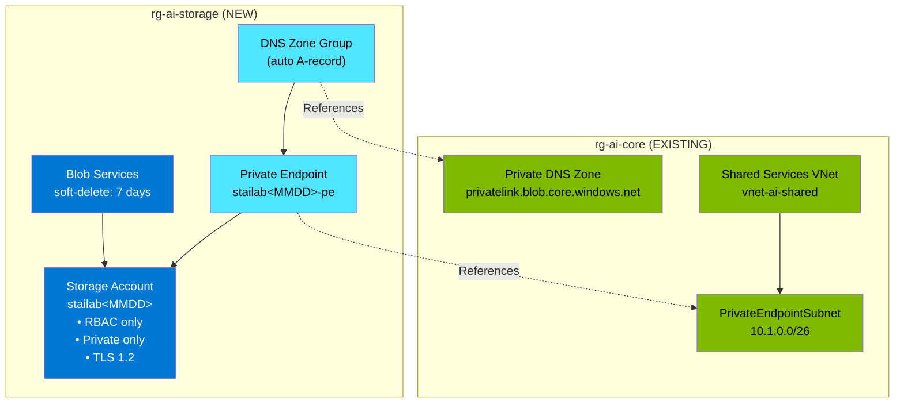

# Data Model: Private Azure Storage Account Infrastructure

**Feature**: 009-private-storage  
**Phase**: 1 - Design & Contracts  
**Date**: 2026-01-17

## Overview

This document defines the Azure resource entities for the Private Storage Account infrastructure. Each entity maps to an Azure resource type with specific configuration requirements per the specification and research decisions.

---

## Entity 1: Resource Group

**Type**: `Microsoft.Resources/resourceGroups`  
**Name**: `rg-ai-storage`  
**Scope**: Subscription

### Properties
| Property | Value | Source |
|----------|-------|--------|
| name | `rg-ai-storage` | Constitution naming convention |
| location | `eastus2` | Matches core infrastructure |

### Tags (Required per Constitution)
| Tag | Example Value | Description |
|-----|---------------|-------------|
| environment | `dev` | Deployment environment |
| purpose | `Private Storage Account infrastructure` | Resource purpose |
| owner | `<deployer>` | Responsible party |
| deployedBy | `bicep` | Deployment method |

---

## Entity 2: Storage Account

**Type**: `Microsoft.Storage/storageAccounts`  
**Name**: `stailab<MMDD>`  
**Scope**: Resource Group (rg-ai-storage)

### Properties
| Property | Value | Rationale |
|----------|-------|-----------|
| name | `stailab<MMDD>` | Global uniqueness with date suffix |
| location | `eastus2` | Matches core infrastructure |
| sku.name | `Standard_LRS` | Cost-effective for lab |
| kind | `StorageV2` | General-purpose v2 |
| properties.accessTier | `Hot` | Frequent access tier |
| properties.allowSharedKeyAccess | `false` | RBAC-only authentication |
| properties.minimumTlsVersion | `TLS1_2` | Security requirement |
| properties.supportsHttpsTrafficOnly | `true` | Secure transfer required |
| properties.publicNetworkAccess | `Disabled` | Private endpoint only |
| properties.networkAcls.defaultAction | `Deny` | Block all public access |
| properties.networkAcls.bypass | `None` | No Azure services bypass |

### Naming Constraints
- 3-24 characters
- Lowercase letters and numbers only (no hyphens!)
- Globally unique across all Azure subscriptions

### Relationships
- **Parent**: Resource Group (rg-ai-storage)
- **References**: Private Endpoint (for network access)

---

## Entity 3: Blob Services

**Type**: `Microsoft.Storage/storageAccounts/blobServices`  
**Name**: `default`  
**Scope**: Storage Account

### Properties
| Property | Value | Rationale |
|----------|-------|-----------|
| deleteRetentionPolicy.enabled | `true` | Soft-delete enabled |
| deleteRetentionPolicy.days | `7` | Lab retention period |

### Relationships
- **Parent**: Storage Account

---

## Entity 4: Private Endpoint

**Type**: `Microsoft.Network/privateEndpoints`  
**Name**: `stailab<MMDD>-pe`  
**Scope**: Resource Group (rg-ai-storage)

### Properties
| Property | Value | Rationale |
|----------|-------|-----------|
| location | `eastus2` | Same as storage account |
| subnet.id | `<PrivateEndpointSubnet resource ID>` | Core infrastructure subnet |
| privateLinkServiceConnections[0].groupIds | `['blob']` | Blob subresource |
| privateLinkServiceConnections[0].privateLinkServiceId | `<Storage Account resource ID>` | Target resource |

### Relationships
- **Parent**: Resource Group (rg-ai-storage)
- **References**: Storage Account (target), Subnet (network)

---

## Entity 5: Private DNS Zone Group

**Type**: `Microsoft.Network/privateEndpoints/privateDnsZoneGroups`  
**Name**: `default`  
**Scope**: Private Endpoint

### Properties
| Property | Value | Rationale |
|----------|-------|-----------|
| privateDnsZoneConfigs[0].name | `blob-dns` | Configuration name |
| privateDnsZoneConfigs[0].privateDnsZoneId | `<privatelink.blob.core.windows.net zone ID>` | Existing DNS zone |

### Relationships
- **Parent**: Private Endpoint
- **References**: Private DNS Zone (in rg-ai-core)

### Notes
- DNS zone already exists in rg-ai-core (deployed by core infrastructure)
- Zone group automatically creates A record for storage account FQDN
- A record points to private endpoint NIC IP address

---

## Entity 6: VNet and Subnet (Existing)

**Type**: `Microsoft.Network/virtualNetworks/subnets`  
**Name**: `vnet-ai-shared/PrivateEndpointSubnet`  
**Scope**: Resource Group (rg-ai-core)

### Notes
- **Already deployed** by core infrastructure
- **Do not create** - only reference
- Address range: `10.1.0.0/26`

---

## Entity 7: Private DNS Zone (Existing)

**Type**: `Microsoft.Network/privateDnsZones`  
**Name**: `privatelink.blob.core.windows.net`  
**Scope**: Resource Group (rg-ai-core)

### Notes
- **Already deployed** by core infrastructure
- **Do not create** - only reference
- Linked to vnet-ai-shared for resolution

---

## Resource Dependency Graph

---

## Bicep Module Interface

### Input Parameters

| Parameter | Type | Required | Default | Description |
|-----------|------|----------|---------|-------------|
| `location` | string | No | `'eastus2'` | Azure region |
| `environment` | string | No | `'dev'` | Environment tag |
| `owner` | string | Yes | - | Owner for tagging |
| `storageNameSuffix` | string | No | `utcNow('MMdd')` | Unique suffix for name |
| `skuName` | string | No | `'Standard_LRS'` | Storage SKU |
| `enableBlobSoftDelete` | bool | No | `true` | Enable blob soft-delete |
| `softDeleteRetentionDays` | int | No | `7` | Soft-delete retention |
| `privateEndpointSubnetId` | string | Yes | - | Subnet for private endpoint |
| `privateDnsZoneId` | string | Yes | - | DNS zone for A record |
| `adminPrincipalId` | string | No | `''` | User for RBAC assignment |

### Outputs

| Output | Type | Description |
|--------|------|-------------|
| `storageAccountId` | string | Storage account resource ID |
| `storageAccountName` | string | Storage account name |
| `blobEndpoint` | string | Blob service endpoint URL |
| `privateEndpointId` | string | Private endpoint resource ID |
| `privateIpAddress` | string | Private endpoint NIC IP |

---

## Validation Rules

### Pre-Deployment
1. Storage account name must be globally unique (check with `az storage account check-name`)
2. Private DNS zone must exist in rg-ai-core
3. Subnet must exist and have sufficient address space
4. Deploying user must have Contributor on subscription

### Post-Deployment
1. Storage account must have `allowSharedKeyAccess: false`
2. Storage account must have `publicNetworkAccess: Disabled`
3. Private endpoint must be in `Succeeded` provisioning state
4. DNS A record must resolve to private IP (10.1.0.x)
