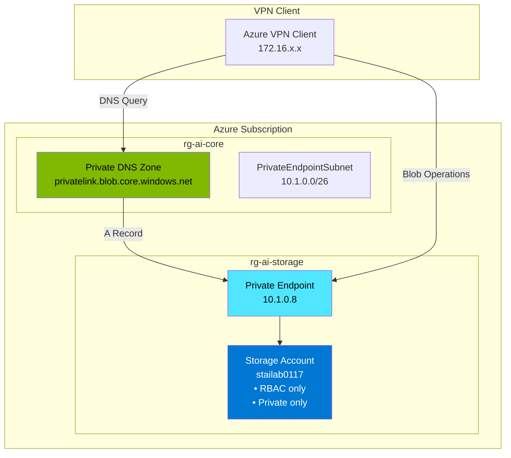

# Quickstart: Private Azure Storage Account Infrastructure

**Feature**: 009-private-storage  
**Phase**: 1 - Design & Contracts  
**Date**: 2026-01-17

## Overview

This guide provides step-by-step instructions to deploy a Private Azure Storage Account with private endpoint connectivity, RBAC authorization, and DNS integration.

**Time to deploy**: ~2-3 minutes

---

## Prerequisites

### Required Infrastructure

1. **Core Infrastructure Deployed**:
   - Resource group `rg-ai-core` exists
   - Virtual WAN hub deployed
   - Shared services VNet (`vnet-ai-shared` with `PrivateEndpointSubnet`)
   - Private DNS zone `privatelink.blob.core.windows.net` exists
   
   ```bash
   # Verify core infrastructure
   az group show --name rg-ai-core --query id -o tsv
   az network private-dns zone show \
     --resource-group rg-ai-core \
     --name privatelink.blob.core.windows.net \
     --query id -o tsv
   ```

2. **VPN Connection** (for validation):
   - Azure VPN Client installed and connected
   - Required for DNS resolution testing and blob operations

### Required Tools

- **Azure CLI** 2.50.0 or later
- **jq** for JSON parsing (used by scripts)

### Required Permissions

| Role | Scope | Purpose |
|------|-------|---------|
| Contributor | Subscription | Create resource group and storage account |
| Network Contributor | vnet-ai-shared | Create private endpoint |

---

## Deployment Steps

### Step 1: Clone Repository and Navigate

```bash
git clone https://github.com/acworkma/AI-Lab.git
cd AI-Lab
git checkout 009-private-storage
```

### Step 2: Configure Parameters

Copy and customize the parameter file:

```bash
cp bicep/storage-infra/main.parameters.example.json \
   bicep/storage-infra/main.parameters.json
```

Edit `main.parameters.json`:

```json
{
  "$schema": "https://schema.management.azure.com/schemas/2019-04-01/deploymentParameters.json#",
  "contentVersion": "1.0.0.0",
  "parameters": {
    "location": {
      "value": "eastus2"
    },
    "environment": {
      "value": "dev"
    },
    "owner": {
      "value": "your-name"
    },
    "storageNameSuffix": {
      "value": "0117"
    }
  }
}
```

### Step 3: Validate Prerequisites

```bash
./scripts/validate-storage-infra.sh --pre-deploy
```

Expected output:
```
[INFO] Validating prerequisites...
[OK] Azure CLI authenticated
[OK] Core infrastructure exists (rg-ai-core)
[OK] Private DNS zone exists (privatelink.blob.core.windows.net)
[OK] Subnet exists (PrivateEndpointSubnet)
[OK] Storage account name 'stailab0117' is available
[INFO] All prerequisites met
```

### Step 4: Deploy

```bash
./scripts/deploy-storage-infra.sh
```

Or with auto-approve:

```bash
./scripts/deploy-storage-infra.sh --yes
```

Expected output:
```
[INFO] Starting Private Storage Account deployment...
[INFO] Running what-if analysis...

Resource changes:
  + Microsoft.Resources/resourceGroups (rg-ai-storage)
  + Microsoft.Storage/storageAccounts (stailab0117)
  + Microsoft.Network/privateEndpoints (stailab0117-pe)

Proceed with deployment? [y/N]: y

[INFO] Deploying...
[OK] Deployment completed in 47 seconds

=== Deployment Summary ===
Storage Account: stailab0117
Blob Endpoint: https://stailab0117.blob.core.windows.net/
Private IP: 10.1.0.8
```

### Step 5: Validate Deployment

```bash
./scripts/validate-storage-infra.sh
```

Expected output:
```
[INFO] Validating storage account configuration...
[OK] Storage account exists: stailab0117
[OK] Shared key access disabled
[OK] Public network access disabled
[OK] TLS 1.2 enforced
[OK] Private endpoint provisioned
[INFO] All validations passed
```

### Step 6: Validate DNS (from VPN)

Connect to VPN, then:

```bash
./scripts/validate-storage-infra-dns.sh
```

Expected output:
```
[INFO] Validating DNS resolution...
[OK] DNS zone exists: privatelink.blob.core.windows.net
[OK] A record exists for stailab0117.blob.core.windows.net
[OK] Resolution: stailab0117.blob.core.windows.net -> 10.1.0.8
[OK] Latency: 23ms (target: <100ms)
[INFO] DNS validation passed
```

---

## Post-Deployment: Grant Access

### Assign Storage Blob Data Contributor

```bash
# Get your principal ID
USER_ID=$(az ad signed-in-user show --query id -o tsv)

# Assign role
./scripts/grant-storage-infra-roles.sh --principal-id "$USER_ID"
```

Or manually:

```bash
STORAGE_ID=$(az storage account show \
  --name "stailab0117" \
  --resource-group "rg-ai-storage" \
  --query id -o tsv)

az role assignment create \
  --role "Storage Blob Data Contributor" \
  --assignee-object-id "$USER_ID" \
  --scope "$STORAGE_ID"
```

---

## Using the Storage Account

### Create a Container

```bash
az storage container create \
  --account-name "stailab0117" \
  --name "test-container" \
  --auth-mode login
```

### Upload a Blob

```bash
echo "Hello from private storage" > test.txt

az storage blob upload \
  --account-name "stailab0117" \
  --container-name "test-container" \
  --name "test.txt" \
  --file "test.txt" \
  --auth-mode login
```

### List Blobs

```bash
az storage blob list \
  --account-name "stailab0117" \
  --container-name "test-container" \
  --auth-mode login \
  --output table
```

### Download a Blob

```bash
az storage blob download \
  --account-name "stailab0117" \
  --container-name "test-container" \
  --name "test.txt" \
  --file "downloaded.txt" \
  --auth-mode login
```

---

## Cleanup

To remove all resources:

```bash
./scripts/cleanup-storage-infra.sh
```

Or manually:

```bash
az group delete --name rg-ai-storage --yes --no-wait
```

---

## Troubleshooting

### Storage Account Name Already Taken

```
ERROR: The storage account named 'stailab0117' is already taken.
```

**Solution**: Use a different suffix in parameters:
```json
{
  "storageNameSuffix": {
    "value": "0118"
  }
}
```

### DNS Resolution Returns Public IP

```
nslookup stailab0117.blob.core.windows.net
# Returns: 52.x.x.x (public IP)
```

**Cause**: Not connected to VPN or DNS zone not linked.

**Solution**:
1. Connect to Azure VPN
2. Verify DNS zone link:
   ```bash
   az network private-dns link vnet show \
     --resource-group rg-ai-core \
     --zone-name privatelink.blob.core.windows.net \
     --name vnet-ai-shared-link
   ```

### Authorization Failed (403)

```
ERROR: AuthorizationPermissionMismatch
```

**Cause**: Missing Storage Blob Data Contributor role.

**Solution**:
```bash
USER_ID=$(az ad signed-in-user show --query id -o tsv)
./scripts/grant-storage-infra-roles.sh --principal-id "$USER_ID"
```

### Shared Key Access Attempted

```
ERROR: Shared key authorization is not permitted
```

**Cause**: Trying to use storage account key instead of Azure AD.

**Solution**: Always use `--auth-mode login`:
```bash
az storage blob list \
  --account-name "stailab0117" \
  --container-name "test-container" \
  --auth-mode login  # Required!
```

---

## Architecture Diagram



---

## Next Steps

1. **Add CMK encryption**: Deploy 005-storage-cmk to add customer-managed key encryption
2. **Create additional containers**: Organize data by project or purpose
3. **Set up lifecycle policies**: Automatically tier or delete old blobs
4. **Enable diagnostics**: Send logs to Log Analytics for monitoring
