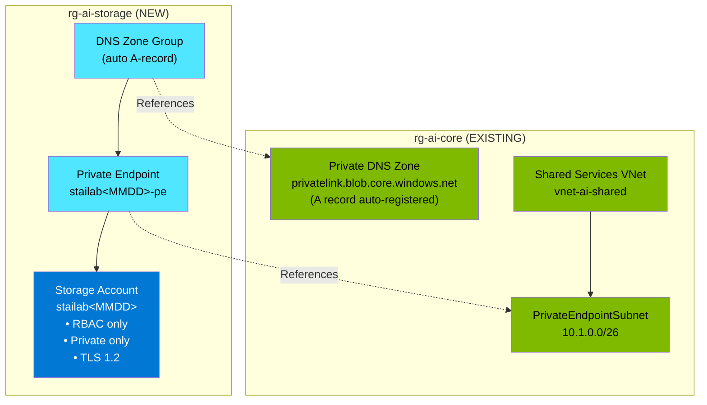

# Research: Private Azure Storage Account Infrastructure

**Feature**: 009-private-storage  
**Phase**: 0 - Research & Decision Log  
**Date**: 2026-01-17

## Overview

Research findings for implementing Azure Storage Account with private endpoint connectivity, RBAC authorization (shared key disabled), and integration with existing private DNS infrastructure. This document resolves all research tasks identified in the implementation plan.

## Research Tasks Completed

1. **Storage Account Naming Strategy** - Global uniqueness and character constraints
2. **Private Endpoint Configuration** - Blob subresource DNS zone group setup
3. **RBAC Roles** - Required roles for deployment and operations
4. **Blob Soft-Delete Configuration** - Retention settings
5. **Security Hardening** - TLS, secure transfer, shared key disabled

---

## Decision 1: Storage Account Naming Strategy

### Decision
Use naming pattern `stailab<MMDD>` where MMDD is deployment date (e.g., `stailab0117`)

### Rationale
- **Global Uniqueness**: Storage account names must be globally unique across all Azure
- **Character Constraints**: 3-24 characters, lowercase letters and numbers only (no hyphens!)
- **Predictability**: Date-based suffix is human-readable and traceable to deployment
- **Spec Alignment**: Clarification session confirmed this approach
- **Existing Pattern**: Matches Key Vault naming pattern from 008-private-keyvault

### Naming Examples
- `stailab0117` (deployed January 17)
- `stailab0315` (deployed March 15)

### Implementation
```bicep
// Default suffix based on deployment date
param storageNameSuffix string = utcNow('MMdd')
var storageAccountName = 'stailab${storageNameSuffix}'
```

### Alternatives Considered
- **UniqueString()**: Harder to identify/trace, less human-readable
- **Random characters**: Unpredictable, harder to document
- **Environment suffix** (e.g., `stailabdev`): May conflict across multiple deploys

### References
- [Storage account naming rules](https://learn.microsoft.com/en-us/azure/azure-resource-manager/management/resource-name-rules#microsoftstorage)

---

## Decision 2: Private Endpoint Configuration

### Decision
Create private endpoint with DNS zone group linking to existing `privatelink.blob.core.windows.net` in rg-ai-core

### Rationale
- **Infrastructure Ready**: Core deployment already has the private DNS zone for blob storage
- **Zero DNS Duplication**: Reuse existing zone instead of creating new one
- **Constitution Alignment**: Principle 6 - modularity, leverage core infrastructure
- **Automatic DNS Registration**: Private endpoint creates A record in linked DNS zone

### Configuration Details
```bicep
// Private endpoint for Storage Account blob
resource privateEndpoint 'Microsoft.Network/privateEndpoints@2023-11-01' = {
  name: '${storageAccountName}-pe'
  location: location
  properties: {
    subnet: {
      id: privateEndpointSubnetId  // PrivateEndpointSubnet in vnet-ai-shared
    }
    privateLinkServiceConnections: [{
      name: '${storageAccountName}-plsc'
      properties: {
        privateLinkServiceId: storageAccount.id
        groupIds: ['blob']  // Storage Account blob subresource
      }
    }]
  }
}

// DNS zone group for automatic A record registration
resource dnsZoneGroup 'Microsoft.Network/privateEndpoints/privateDnsZoneGroups@2023-11-01' = {
  parent: privateEndpoint
  name: 'default'
  properties: {
    privateDnsZoneConfigs: [{
      name: 'blob-dns'
      properties: {
        privateDnsZoneId: privateDnsZoneId  // privatelink.blob.core.windows.net in rg-ai-core
      }
    }]
  }
}
```

### Private DNS Zone Details
| Zone | Resource Group | Purpose |
|------|----------------|---------|
| `privatelink.blob.core.windows.net` | rg-ai-core | Blob storage endpoint resolution |

### Alternatives Considered
- **Create new DNS zone**: Would duplicate existing zone; violates DRY
- **Azure DNS Private Resolver only**: Still needs zone link; PE provides automatic A record

---

## Decision 3: RBAC Roles for Deployment and Operations

### Decision
Use Azure built-in roles for deployment and operations; shared key access disabled

### Deployment Roles (Infrastructure Engineer)

| Role | Scope | GUID | Purpose |
|------|-------|------|---------|
| **Contributor** | Subscription | `b24988ac-6180-42a0-ab88-20f7382dd24c` | Create storage account and RG |
| **Network Contributor** | VNet | `4d97b98b-1d4f-4787-a291-c67834d212e7` | Create private endpoint |

### Operations Roles (Developer/User)

| Role | Scope | GUID | Purpose |
|------|-------|------|---------|
| **Storage Blob Data Contributor** | Storage Account | `ba92f5b4-2d11-453d-a403-e96b0029c9fe` | Full blob CRUD operations |
| **Storage Blob Data Reader** | Storage Account | `2a2b9908-6ea1-4ae2-8e65-a410df84e7d1` | Read-only blob access |

### Implementation
```bicep
// Optional: Assign Storage Blob Data Contributor during deployment
param adminPrincipalId string = ''

resource roleAssignment 'Microsoft.Authorization/roleAssignments@2022-04-01' = if (!empty(adminPrincipalId)) {
  scope: storageAccount
  name: guid(storageAccount.id, adminPrincipalId, 'ba92f5b4-2d11-453d-a403-e96b0029c9fe')
  properties: {
    roleDefinitionId: subscriptionResourceId('Microsoft.Authorization/roleDefinitions', 'ba92f5b4-2d11-453d-a403-e96b0029c9fe')
    principalId: adminPrincipalId
    principalType: 'User'
  }
}
```

### Shared Key Access Disabled
With `allowSharedKeyAccess: false`, all access must use Azure AD authentication:
- CLI: `--auth-mode login`
- SDKs: DefaultAzureCredential or managed identity
- No SAS tokens or account keys

---

## Decision 4: Blob Soft-Delete Configuration

### Decision
Enable blob soft-delete with 7-day retention (configurable via parameter)

### Rationale
- **Data Protection**: Prevents accidental deletion
- **Cost Efficiency**: 7 days is sufficient for lab environment
- **Configurable**: Production can increase to 30+ days

### Implementation
```bicep
param softDeleteRetentionDays int = 7
param enableBlobSoftDelete bool = true

resource blobServices 'Microsoft.Storage/storageAccounts/blobServices@2023-01-01' = {
  parent: storageAccount
  name: 'default'
  properties: {
    deleteRetentionPolicy: {
      enabled: enableBlobSoftDelete
      days: softDeleteRetentionDays
    }
  }
}
```

### Alternatives Considered
- **No soft-delete**: Risk of permanent data loss
- **Container soft-delete**: Additional protection; can enable later
- **Versioning**: Overkill for base infrastructure; defer to CMK layer

---

## Decision 5: Security Hardening

### Decision
Enforce TLS 1.2 minimum, require secure transfer (HTTPS), disable shared key access

### Rationale
- **TLS 1.2**: Industry standard; deprecates vulnerable TLS 1.0/1.1
- **Secure Transfer**: Prevents unencrypted HTTP access
- **No Shared Keys**: Forces Azure AD authentication; more secure and auditable

### Implementation
```bicep
resource storageAccount 'Microsoft.Storage/storageAccounts@2023-01-01' = {
  name: storageAccountName
  location: location
  sku: {
    name: 'Standard_LRS'
  }
  kind: 'StorageV2'
  properties: {
    accessTier: 'Hot'
    allowSharedKeyAccess: false          // RBAC-only authentication
    minimumTlsVersion: 'TLS1_2'          // Enforce TLS 1.2
    supportsHttpsTrafficOnly: true       // HTTPS required
    publicNetworkAccess: 'Disabled'      // Private endpoint only
    networkAcls: {
      defaultAction: 'Deny'
      bypass: 'None'
    }
  }
}
```

### References
- [Azure Storage security recommendations](https://learn.microsoft.com/en-us/azure/storage/blobs/security-recommendations)

---

## Resource Dependency Summary



---

## Validation Script Requirements

### Pre-Deployment Checks (validate-storage-infra.sh)
1. Core infrastructure exists (rg-ai-core)
2. Private DNS zone exists (privatelink.blob.core.windows.net)
3. VNet and subnet exist (vnet-ai-shared/PrivateEndpointSubnet)
4. User has required RBAC roles
5. Storage account name not taken (global uniqueness)

### Post-Deployment Checks
1. Storage account created with correct properties
2. Private endpoint provisioned
3. DNS A record registered
4. Public access denied
5. Shared key access disabled

### DNS Validation (validate-storage-infra-dns.sh)
```bash
# Resolve storage account FQDN
nslookup ${STORAGE_NAME}.blob.core.windows.net

# Expected: Private IP in 10.1.0.x range
# Latency target: <100ms
```

---

## References

- [Azure Storage Account overview](https://learn.microsoft.com/en-us/azure/storage/common/storage-account-overview)
- [Private endpoints for Azure Storage](https://learn.microsoft.com/en-us/azure/storage/common/storage-private-endpoints)
- [Disable shared key authorization](https://learn.microsoft.com/en-us/azure/storage/common/shared-key-authorization-prevent)
- [Azure RBAC for storage](https://learn.microsoft.com/en-us/azure/storage/blobs/authorize-access-azure-active-directory)
