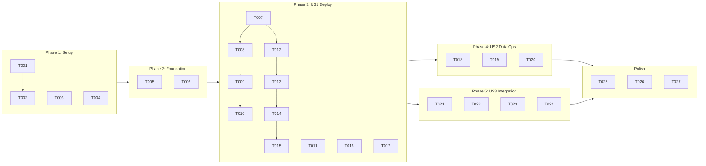

---

description: "Task list for Private Azure Storage Account infrastructure"
---

# Tasks: 009-private-storage

**Input**: Design documents from `/specs/009-private-storage/`
**Prerequisites**: plan.md (required), spec.md (user stories), research.md, data-model.md, contracts/

**Tests**: Tests are not explicitly requested; include validation tasks for deployments and ops.

**Organization**: Tasks grouped by user story to enable independent implementation and testing.

## Format: `[ID] [P?] [Story] Description`

- **[P]**: Can run in parallel (different files, no dependencies)
- **[Story]**: Which user story (US1, US2, US3)
- Include exact file paths in descriptions

---

## Phase 1: Setup (Shared Infrastructure)

**Purpose**: Project initialization and basic structure

- [X] T001 Create Bicep module scaffold `bicep/modules/storage-account.bicep`
- [X] T002 Create orchestration scaffold `bicep/storage-infra/main.bicep`
- [X] T003 [P] Create parameter template `bicep/storage-infra/main.parameters.example.json`
- [X] T004 [P] Create script stubs `scripts/deploy-storage-infra.sh` and `scripts/validate-storage-infra.sh`

---

## Phase 2: Foundational (Blocking Prerequisites)

**Purpose**: Core prerequisites before any user story

- [X] T005 Populate `bicep/storage-infra/main.parameters.json` with dev defaults (location, owner, suffix)
- [X] T006 Implement prerequisite checks in `scripts/validate-storage-infra.sh` (rg-ai-core, vnet, dns zone)

**Checkpoint**: Foundation ready - user story implementation can begin

---

## Phase 3: User Story 1 - Deploy Private Storage Account (Priority: P1) 🎯 MVP

**Goal**: Deploy storage account with private endpoint, RBAC-only auth, DNS integration
**Independent Test**: Deploy to `rg-ai-storage`, verify private endpoint, confirm public access disabled, validate DNS resolution

- [X] T007 [US1] Implement storage account resource in `bicep/modules/storage-account.bicep` with:
  - StorageV2, Standard_LRS
  - allowSharedKeyAccess: false
  - minimumTlsVersion: TLS1_2
  - supportsHttpsTrafficOnly: true
  - publicNetworkAccess: Disabled
- [X] T008 [US1] Implement blob services with soft-delete in `bicep/modules/storage-account.bicep`
- [X] T009 [US1] Implement private endpoint resource in `bicep/modules/storage-account.bicep` with groupIds: ['blob']
- [X] T010 [US1] Implement DNS zone group for privatelink.blob.core.windows.net in `bicep/modules/storage-account.bicep`
- [X] T011 [P] [US1] Add optional RBAC assignment (Storage Blob Data Contributor) in `bicep/modules/storage-account.bicep`
- [X] T012 [US1] Add outputs (storageAccountId, storageAccountName, blobEndpoint, privateEndpointId, privateIpAddress) in `bicep/modules/storage-account.bicep`
- [X] T013 [US1] Wire orchestration to module with RG creation and core references in `bicep/storage-infra/main.bicep`
- [X] T014 [US1] Implement `scripts/deploy-storage-infra.sh` with what-if, validation, timing capture
- [X] T015 [US1] Implement post-deployment checks in `scripts/validate-storage-infra.sh` (shared key disabled, public access disabled, TLS)
- [X] T016 [P] [US1] Implement `scripts/validate-storage-infra-dns.sh` for DNS resolution check (<100ms target)
- [X] T017 [P] [US1] Implement `scripts/cleanup-storage-infra.sh` for resource group deletion

---

## Phase 4: User Story 2 - Manage Blob Data via CLI (Priority: P2)

**Goal**: Data operations via CLI with `--auth-mode login` over VPN
**Independent Test**: Create container, upload/download blob, verify with CLI commands

- [X] T018 [US2] Implement `scripts/grant-storage-infra-roles.sh` for RBAC assignment (Storage Blob Data Contributor/Reader)
- [X] T019 [P] [US2] Implement `scripts/storage-infra-ops.sh` with container create, blob upload/download, list operations
- [X] T020 [US2] Update `specs/009-private-storage/quickstart.md` with ops script references

---

## Phase 5: User Story 3 - Integrate with Existing Infrastructure (Priority: P3)

**Goal**: Consistent patterns matching key-vault.bicep, idempotent deployments, documentation
**Independent Test**: Structure matches key-vault.bicep; what-if clean on redeploy; docs complete

- [X] T021 [US3] Ensure module pattern matches `bicep/modules/key-vault.bicep` (naming, params, outputs)
- [X] T022 [P] [US3] Add idempotency check to `scripts/validate-storage-infra.sh` (redeploy with no changes)
- [X] T023 [US3] Create `docs/storage-infra/README.md` with all required sections per constitution
- [X] T024 [US3] Update root `README.md` Infrastructure Projects section with storage-infra link

---

## Final Phase: Polish & Cross-Cutting

- [X] T025 [P] Run `az bicep build` on all storage-infra Bicep files for validation
- [X] T026 Review and update `specs/009-private-storage/plan.md` Phase 2 status to COMPLETED
- [X] T027 [P] Validate tags (environment, purpose, owner, deployedBy) in deployment

---

## Dependency Graph

---

## Parallel Execution Opportunities

### Phase 1 (Setup)
- T003 and T004 can run in parallel after T001/T002

### Phase 3 (US1 - Deploy)
- T011 (RBAC), T016 (DNS validation), T017 (cleanup) can run in parallel

### Phase 4 (US2 - Data Ops)
- T019 can run in parallel with T018

### Phase 5 (US3 - Integration)
- T022 can run in parallel with T021

### Final Phase
- T025, T026, T027 can all run in parallel

---

## Implementation Strategy

**MVP Scope**: Phase 1 + Phase 2 + Phase 3 (US1) = Deployable private storage account

**Incremental Delivery**:
1. First: Deploy storage with private endpoint (US1) - validates core functionality
2. Then: Add data operations (US2) - enables actual usage
3. Finally: Polish integration (US3) - ensures consistency

**Total Tasks**: 27
- Phase 1 (Setup): 4 tasks
- Phase 2 (Foundation): 2 tasks
- Phase 3 (US1): 11 tasks
- Phase 4 (US2): 3 tasks
- Phase 5 (US3): 4 tasks
- Final: 3 tasks
