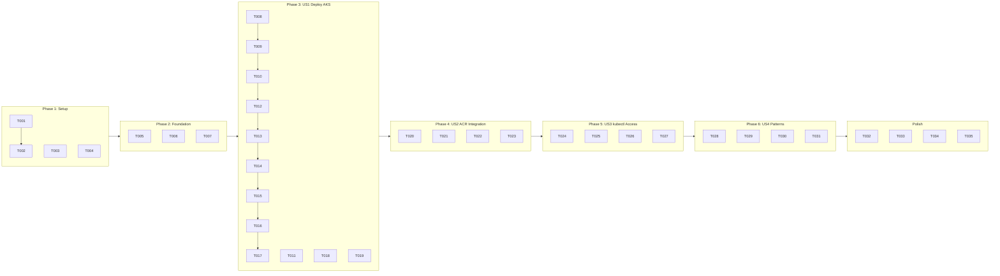

---

description: "Task list for Private Azure Kubernetes Service infrastructure"
---

# Tasks: 011-private-aks

**Input**: Design documents from `/specs/011-private-aks/`
**Prerequisites**: plan.md (required), spec.md (user stories)

**Tests**: Tests are not explicitly requested; include validation tasks for deployments and kubectl access.

**Organization**: Tasks grouped by user story to enable independent implementation and testing.

## Format: `[ID] [P?] [Story] Description`

- **[P]**: Can run in parallel (different files, no dependencies)
- **[Story]**: Which user story (US1, US2, US3, US4)
- Include exact file paths in descriptions

---

## Phase 1: Setup (Shared Infrastructure)

**Purpose**: Project initialization and basic structure

- [X] T001 Create Bicep module scaffold `bicep/modules/aks.bicep`
- [X] T002 Create orchestration scaffold `bicep/aks/main.bicep`
- [X] T003 [P] Create parameter template `bicep/aks/main.parameters.example.json`
- [X] T004 [P] Create script stubs `scripts/deploy-aks.sh` and `scripts/validate-aks.sh`

---

## Phase 2: Foundational (Blocking Prerequisites)

**Purpose**: Core prerequisites before any user story

- [X] T005 Populate `bicep/aks/main.parameters.json` with dev defaults (location, clusterName, nodeCount, vmSize)
- [X] T006 [P] Implement prerequisite checks in `scripts/validate-aks.sh` (rg-ai-core, vnet, dns zones, ACR)
- [X] T007 [P] Query and document current Azure default K8s version via `az aks get-versions --location eastus2`

**Checkpoint**: Foundation ready - user story implementation can begin

---

## Phase 3: User Story 1 - Deploy Private AKS Cluster (Priority: P1) 🎯 MVP

**Goal**: Deploy AKS cluster with private API server, Azure RBAC, Azure CNI Overlay, 3-node HA across AZs
**Independent Test**: Deploy to `rg-ai-aks`, verify private cluster mode, confirm no public endpoint, validate DNS resolution

### AKS Module Implementation

- [X] T008 [US1] Implement AKS cluster resource in `bicep/modules/aks.bicep` with:
  - identity: SystemAssigned
  - enableRBAC: true
  - disableLocalAccounts: true
  - networkProfile: azureCNIOverlay with podCidr 10.244.0.0/16
  - apiServerAccessProfile: enablePrivateCluster: true
- [X] T009 [US1] Implement system node pool in `bicep/modules/aks.bicep` with:
  - count: 3
  - vmSize: Standard_D2s_v3
  - availabilityZones: ['1', '2', '3']
  - osSKU: AzureLinux
  - mode: System
- [X] T010 [US1] Implement private DNS zone configuration in `bicep/modules/aks.bicep`:
  - privateDnsZone: existing zone ID from rg-ai-core or 'system'
- [X] T011 [P] [US1] Add parameters for cluster name, location, nodeCount, vmSize, kubernetesVersion in `bicep/modules/aks.bicep`
- [X] T012 [US1] Add outputs (clusterName, clusterFqdn, kubeletIdentityObjectId, nodeResourceGroup) in `bicep/modules/aks.bicep`

### Orchestration Implementation

- [X] T013 [US1] Wire orchestration to module with RG creation in `bicep/aks/main.bicep`
- [X] T014 [US1] Add core infrastructure references (VNet, DNS zone) to `bicep/aks/main.bicep`
- [X] T015 [US1] Add appropriate tags (environment, owner, purpose, deployedBy) in `bicep/aks/main.bicep`

### Deployment Scripts

- [X] T016 [US1] Implement `scripts/deploy-aks.sh` with:
  - What-if analysis
  - Prerequisite check (core infra, ACR)
  - Quota check for Standard_D2s_v3
  - Confirmation prompt
  - Deployment with timing capture
  - Output display (cluster name, FQDN, identity)
- [X] T017 [US1] Implement post-deployment validation in `scripts/validate-aks.sh`:
  - Verify privateClusterEnabled: true
  - Verify enableRBAC: true
  - Verify disableLocalAccounts: true
  - Verify node pool zones
- [X] T018 [P] [US1] Implement `scripts/validate-aks-dns.sh` for API server DNS resolution check
- [X] T019 [P] [US1] Implement `scripts/cleanup-aks.sh` for resource group deletion

**Checkpoint**: Private AKS cluster deployed - kubectl access requires ACR integration (US2) and credentials (US3)

---

## Phase 4: User Story 2 - Pull Images from Private ACR (Priority: P2)

**Goal**: AKS cluster authenticates to private ACR via managed identity, pods pull images without secrets
**Independent Test**: Deploy sample pod from ACR image, verify no ImagePullBackOff, confirm AcrPull role exists

- [X] T020 [US2] Implement `scripts/grant-aks-acr-role.sh`:
  - Get AKS kubelet identity
  - Get ACR resource ID from rg-ai-acr
  - Assign AcrPull role to kubelet identity on ACR
  - Verify role assignment
- [X] T021 [US2] Add ACR integration to `scripts/deploy-aks.sh`:
  - Call grant-aks-acr-role.sh after cluster deployment
  - Retry logic for role propagation delay (30-60 sec)
- [X] T022 [P] [US2] Create sample pod manifest `docs/aks/sample-pod.yaml` referencing ACR nginx image
- [X] T023 [US2] Add ACR pull test to `scripts/validate-aks.sh`:
  - Deploy sample pod
  - Wait for Running status
  - Delete test pod

**Checkpoint**: AKS can pull images from private ACR - ready for kubectl access testing

---

## Phase 5: User Story 3 - Manage Cluster via kubectl (Priority: P3)

**Goal**: VPN-connected users can run kubectl commands against the cluster
**Independent Test**: Connect via VPN, get credentials, run `kubectl get nodes`, verify 3 nodes Ready

- [X] T024 [US3] Add kubeconfig retrieval instructions to `scripts/deploy-aks.sh` output:
  - `az aks get-credentials --resource-group rg-ai-aks --name <cluster>`
- [X] T025 [US3] Implement kubectl connectivity test in `scripts/validate-aks.sh`:
  - Get credentials
  - Run `kubectl get nodes`
  - Verify 3 nodes in Ready state
  - Run `kubectl get namespaces`
- [X] T026 [P] [US3] Add VPN connectivity check to `scripts/validate-aks.sh` (ip route grep for VPN CIDR)
- [X] T027 [US3] Add Azure AD RBAC role assignment for cluster admin in `scripts/deploy-aks.sh`:
  - Assign Azure Kubernetes Service Cluster Admin role to deploying user

**Checkpoint**: Full cluster access via kubectl from VPN - ready for documentation

---

## Phase 6: User Story 4 - Integrate with Existing Infrastructure Patterns (Priority: P4)

**Goal**: Consistent patterns matching keyvault/storage-infra, idempotent deployments, documentation
**Independent Test**: Structure matches keyvault; what-if clean on redeploy; docs complete

- [X] T028 [US4] Ensure module pattern matches `bicep/modules/key-vault.bicep` structure (naming, params, outputs)
- [X] T029 [P] [US4] Add idempotency check to `scripts/validate-aks.sh` (redeploy with no changes)
- [X] T030 [US4] Create `docs/aks/README.md` with all required sections:
  - Overview
  - Prerequisites (core, ACR, VPN)
  - Deployment steps
  - Verification commands
  - kubectl usage
  - Troubleshooting
  - Cleanup
- [X] T031 [US4] Update root `README.md` Infrastructure Projects section with aks link

---

## Final Phase: Polish & Cross-Cutting

- [X] T032 [P] Run `az bicep build` on all aks Bicep files for validation
- [X] T033 [P] Add inline Bicep comments explaining AKS configuration decisions
- [X] T034 Review and update `specs/011-private-aks/plan.md` Phase 2 status to COMPLETED
- [X] T035 [P] Validate tags (environment, purpose, owner, deployedBy) in deployment

---

## Dependency Graph

---

## Parallel Execution Opportunities

### Phase 1 (Setup)
- T003 and T004 can run in parallel after T001/T002

### Phase 2 (Foundation)
- T006 and T007 can run in parallel with T005

### Phase 3 (US1 - Deploy AKS)
- T011 (parameters), T018 (DNS validation), T019 (cleanup) can run in parallel

### Phase 4 (US2 - ACR Integration)
- T022 (sample pod) can run in parallel with T020/T021

### Phase 5 (US3 - kubectl Access)
- T026 (VPN check) can run in parallel with T024/T025

### Phase 6 (US4 - Patterns)
- T029 (idempotency) can run in parallel with T028

### Final Phase
- T032, T033, T034, T035 can all run in parallel

---

## Implementation Strategy

**MVP Scope**: Phase 1 + Phase 2 + Phase 3 (US1) = Deployable private AKS cluster (19 tasks)

**Incremental Delivery**:
1. First: Deploy AKS with private endpoint (US1) - validates core infrastructure
2. Then: Add ACR integration (US2) - enables workload deployment
3. Then: Add kubectl access (US3) - enables cluster management
4. Finally: Polish patterns and docs (US4) - ensures consistency

**Total Tasks**: 35
- Phase 1 (Setup): 4 tasks
- Phase 2 (Foundation): 3 tasks
- Phase 3 (US1): 12 tasks
- Phase 4 (US2): 4 tasks
- Phase 5 (US3): 4 tasks
- Phase 6 (US4): 4 tasks
- Final: 4 tasks

---

## Notes

- Private AKS cluster requires VPN connection for all kubectl operations
- AKS deployment typically takes 10-15 minutes (longer than Key Vault or Storage)
- Node pool scaling to 3 nodes across AZs requires sufficient quota for Standard_D2s_v3
- Azure CNI Overlay uses internal pod CIDR (10.244.0.0/16) - does not consume VNet IPs
- Azure Linux (CBL-Mariner) is specified as osSKU, not osType
- AcrPull role assignment may take 30-60 seconds to propagate
